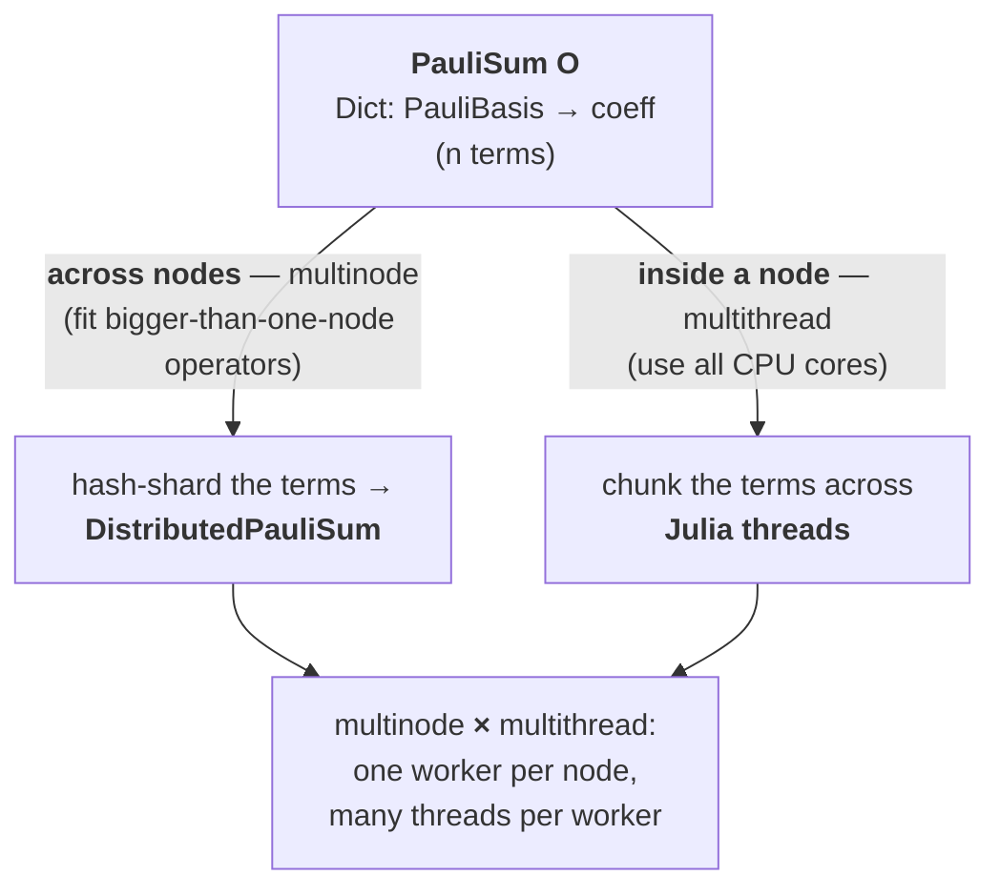
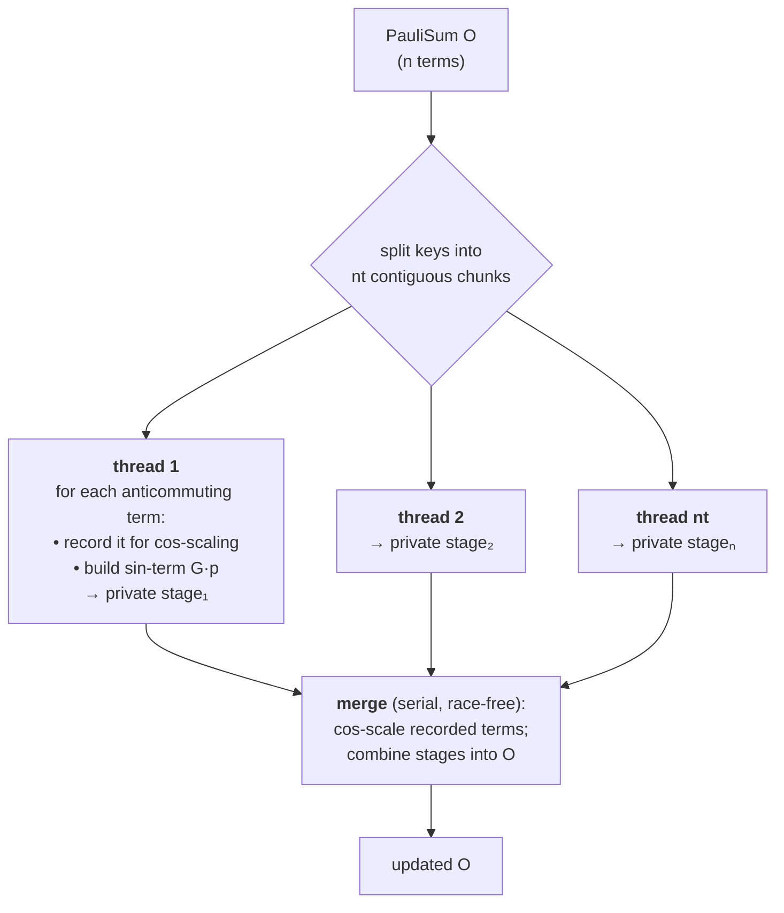
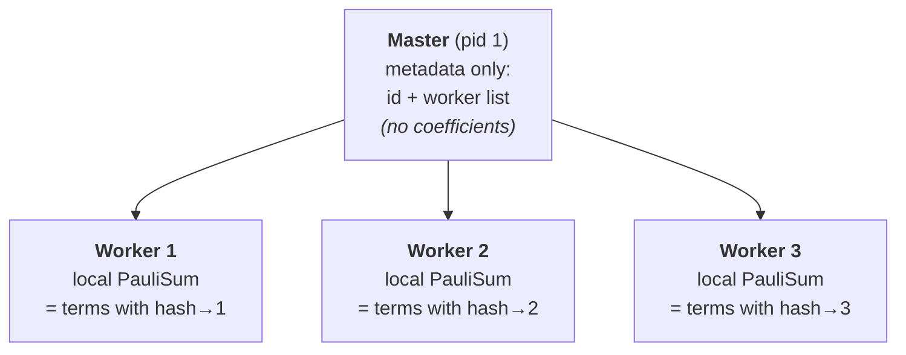
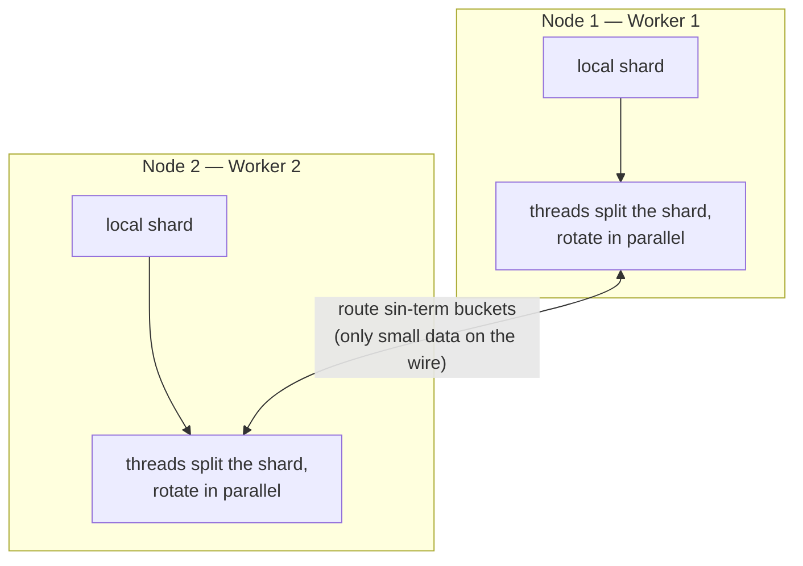

# Multithread & Multinode Pauli Dynamics — How It Works

Sparse Pauli Dynamics evolves an operator `O = Σ cₚ P` (a `PauliSum`, i.e. a
`Dict{PauliBasis → coeff}`) in the Heisenberg picture. On large lattices the sum
grows past what one node can hold or compute in reasonable time, so there are
**two independent axes of parallelism**:



- **Multithread** = one process, many threads sharing memory — uses all cores on
  the terms it already holds.
- **Multinode** = many processes (one per node), each with *private* memory,
  cooperating over the network — lets the operator exceed one node's RAM.

---

## 1. Multithread: one rotation, threaded

A Heisenberg-picture rotation `evolve!(O, G, θ)` splits every term that
anticommutes with the generator `G`:

$$O(\theta) = \cos\theta\,\underbrace{O}_{\text{scale in place}} \;-\; i\sin\theta\,\underbrace{G\,O}_{\text{new "sin" terms}}$$

The terms are chunked across threads. Each thread works on its **own** chunk and
writes only into **private staging** — so there are no shared-dictionary writes
(the classic data race). The cheap cos-scaling and the merge run afterward.



Why it's race-free: each thread owns a disjoint chunk and its own staging
container; nothing writes a shared `Dict` during the parallel phase.

**Threaded reductions** (`expectation_value`, `matrix_element`, `inner_product_threaded`)
follow the same shape — snapshot the terms to a vector, per-thread partial sums,
then combine — and only engage above a term threshold so small operators pay no
overhead.

---

## 2. Multinode: shard the operator across nodes

A `DistributedPauliSum` splits `O` by `hash(PauliBasis) mod nworkers`. The
**master holds only metadata** (an id + the worker list); every coefficient lives
on a worker. `PauliBasis` is an immutable value type, so its hash is identical on
every process — a term has one, well-defined owner everywhere.



A distributed rotation is **three barriers**. The only bulk data on the wire are
the small "sin-term" buckets moving worker→worker (peer to peer, never through
the master); the full operator is never gathered.

```mermaid
sequenceDiagram
    participant M as Master
    participant W1 as Worker 1
    participant W2 as Worker 2
    M->>W1: evolve!(G, θ)
    M->>W2: evolve!(G, θ)
    Note over W1,W2: Phase 1 — local rotation (threaded)<br/>cos-scale own terms; bucket new<br/>sin-terms by their destination owner
    W1-->>W2: bucket of sin-terms owned by W2
    W2-->>W1: bucket of sin-terms owned by W1
    Note over W1,W2: Phase 2 — pull incoming buckets, merge into local shard
    Note over W1,W2: Phase 3 — clear staging
    Note over M,W2: coeff_clip! is then purely local (global threshold)
```

Because each rotation's new terms `G·p` have a definite basis (hence a definite
owner), routing is exact and the shards stay a correct global partition.

---

## 3. Both together

Each worker's *local* rotation (Phase 1 above) is itself the threaded rotation
from §1. So a full run is **one worker process per node, N threads inside each**:



---

## 4. What actually moves, and what to use when

| Move | On the wire | Cost |
|------|-------------|------|
| broadcast a generator `G`, θ | a few bytes | once per rotation |
| route sin-term buckets worker→worker | the new terms only | the sole bulk transfer |
| reductions (norm, expectation, overlaps) | k scalars | tiny |
| gather the full operator (`collect_paulisum`) | everything | **debug only — avoid** |

Measured behavior (1D/2D Heisenberg, Sparse Pauli Dynamics):

- **Multithread is the speed lever.** ~2.4–2.8× on 4–8 threads for the rotation;
  the ceiling is set by the number of *performance* cores, not the code (8
  threads ≈ 4 threads on a 5-P-core laptop; a homogeneous HPC node scales
  further). `mult_threaded` gives ~3.7× at 8 threads on a single-Pauli × PauliSum
  product.
- **Multinode is a memory tool, not a speed tool.** For an operator that *fits*
  one node, sharding only adds per-rotation routing + barriers, so single-node
  multithread beats it. Reach for multinode only when the retained operator
  exceeds one node's RAM (large lattices / very tight truncation) — there it's
  the difference between running and not running.
- **Staging strategy** (`evolve!` Dict vs `evolve_vec!` Vector) only matters at
  large operators + high thread counts, where the Vector path avoids Dict-rehash
  contention (~15–20% faster ≳100k terms at 8 threads); below that they tie.

### Entry points

| Function | Role |
|----------|------|
| `distribute`, `collect_paulisum`, `DistributedPauliSum` | shard / gather |
| `evolve!(dO, G, θ; threaded=true)` | one distributed, threaded rotation (Dict staging) |
| `evolve_vec!(dO, G, θ; threaded=true)` | same, Vector staging (large-operator variant) |
| `evolve!(dO, gens, angles; truncation_thresh)` | a full sharded Trotter sweep |
| `coeff_clip!`, `opnorm2`, `sharded_summary` | truncation, norm, per-worker sizes |
| `mult_threaded`, `inner_product_threaded` | threaded PauliSum product / inner product |

The physics kernels are the *same functions* the single-node code calls; the
multithread/multinode layers only decide **who** runs them and combine partials
over disjoint work — which is why every distributed routine is tested to match
serial exactly (`test/test_distributed.jl`: distributed == serial to 1e-12).
